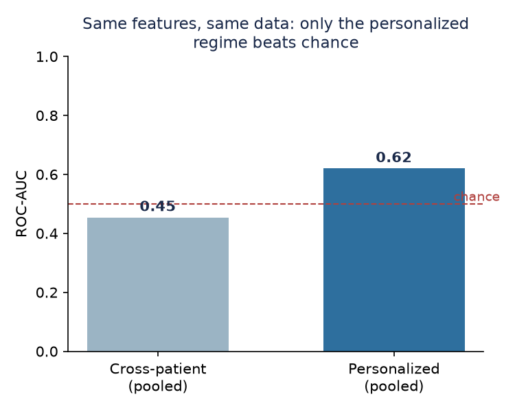
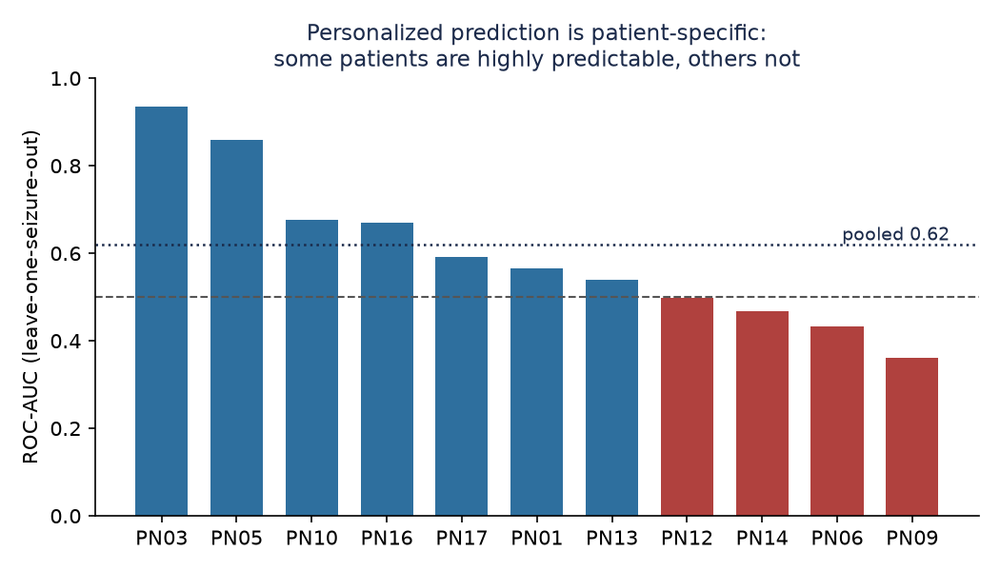
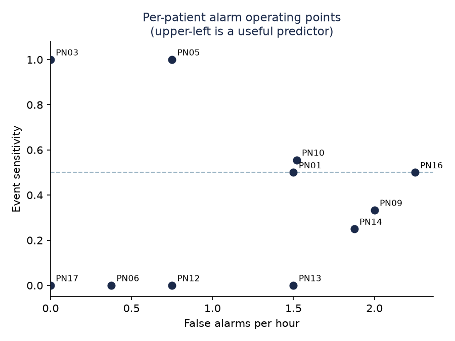
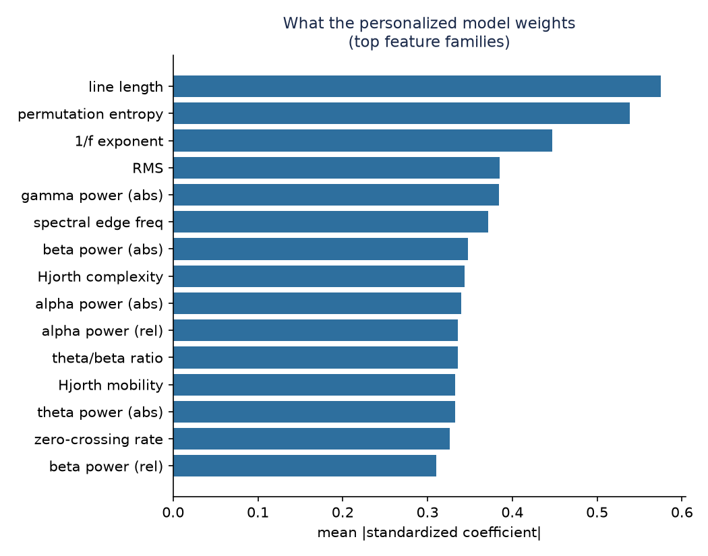
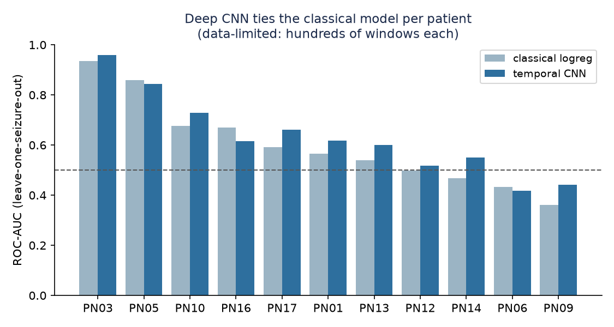
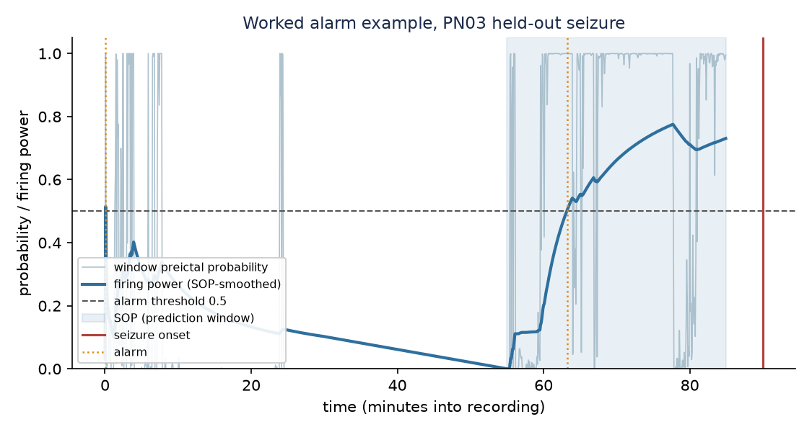

# Seizure Prediction from Scalp EEG


I built a classical machine-learning pipeline that attempts to predict the
**preictal state**, the interval that precedes a seizure, from raw scalp EEG. I
use the [PhysioNet Siena Scalp EEG Database](https://physionet.org/content/siena-scalp-eeg/1.0.0/)
(14 patients, 512 Hz, 10-20 montage, 47 documented seizures over roughly 128
hours).

This is prediction rather than detection. I train a model to separate
*preictal* windows (the 30 minutes before onset, excluding a 5-minute horizon)
from *interictal* windows (more than one hour from any seizure), so that an
alarm could in principle fire before an event rather than flag it as it occurs.

> **Project status.** I processed the complete 14-patient cohort and evaluated
> two regimes. Pooled, cross-patient prediction does not generalize (AUC about
> 0.45, at or below chance), which is the honest negative baseline. Patient
> specific (personalized) models, trained and tested within one person, recover
> real if modest signal (pooled AUC 0.62, 95% CI [0.51, 0.71], permutation
> p = 0.0002). That contrast is the main result: preictal structure is largely
> patient-specific, so the personalized setting is the one worth pursuing.

## Results

I evaluate at two levels. The **window level** asks whether the model can tell a
preictal 5-second window from an interictal one. The **alarm level** asks the
clinical question, how many seizures the system anticipates and how often it
raises a false alarm, because a single artefact can flip dozens of adjacent
windows and distort the window-level numbers in both directions.

**Cross-patient, window level.** Patient-grouped 5-fold cross-validation (no
patient appears in both train and test), 19-channel 10-20 montage, 514 features
per epoch, 40,008 windows (13,607 preictal and 26,401 interictal) across 14
patients:

| Model | ROC-AUC | AUPRC | Sensitivity | Specificity | F1 |
|---|---|---|---|---|---|
| Logistic regression | 0.45 | 0.32 | 0.42 | 0.49 | 0.34 |
| Random forest | 0.41 | 0.30 | 0.22 | 0.66 | 0.23 |

The AUPRC of 0.32 sits at the positive prevalence (0.34), which is the
precision-recall definition of chance. I report AUPRC alongside ROC-AUC because
under class imbalance ROC-AUC can look deceptively healthy while the model has no
real hold on the rarer preictal class (Saito and Rehmsmeier 2015).

**Cross-patient, alarm level.** Firing-Power post-processing (SPH 5 min, SOP 30
min), logistic regression, same patient-grouped cross-validation, with the alarm
threshold selected on the training patients only:

| Operating point | Event sensitivity | FPR/h | Warning time | Random predictor | p |
|---|---|---|---|---|---|
| Default (theta = 0.5) | 28/42 = 0.67 | 1.34 | 32.5 min | 0.49 | 0.015 |
| Tuned threshold | 20/42 = 0.48 | 1.10 | 32.7 min | 0.42 | 0.295 |

**Personalized (patient-specific), window level.** Leave-one-seizure-out
cross-validation within each patient, logistic regression, 11 of 14 patients
evaluable (the other three lack a second seizure or any captured interictal
data):

| | Value |
|---|---|
| Mean patient ROC-AUC | 0.60 |
| Pooled ROC-AUC | 0.62, 95% CI [0.51, 0.71] |
| Pooled AUPRC | 0.53 (prevalence 0.33) |
| Label-permutation p | 0.0002 |
| Best patient (PN03) | 0.93 |
| Worst patient (PN09) | 0.36 |

The pooled AUC of 0.62 is significant on two independent tests: a
patient-clustered bootstrap 95% confidence interval of [0.51, 0.71] that
excludes chance (0.5), and a label-permutation p of 0.0002 (Combrisson and Jerbi
2015). The bootstrap resamples whole patients rather than windows, so it does not
understate uncertainty by treating correlated within-patient windows as
independent. Both confirm the personalized signal is real, if modest, not a
small-sample artefact. These numbers are lower than an earlier version of this
project reported, because I since fixed a crop-optimism bug (see below) that had
inflated them; the honest figure is 0.62.



**Personalized, alarm level.** Per-patient Firing-Power alarms (leave-one-seizure-out
for sensitivity, leave-one-interictal-crop-out for the false-alarm rate). Alarm
prediction is viable for a subset of patients but not universally:

| Patient | Event sensitivity | FPR/h | Warning time |
|---|---|---|---|
| PN03 | 1.00 | 0.00 | 25 min |
| PN05 | 1.00 | 0.75 | 34 min |
| PN10 | 0.56 | 1.52 | 34 min |
| ... | ... | ... | ... |
| Pooled (11 patients) | 0.40 | 1.20 | |

Measured against a real interictal baseline, the pooled alarm result is at chance
(sensitivity 0.40, p = 0.78), but individual patients stand out sharply: PN03
anticipates both of its seizures with zero false alarms per hour, 25 minutes
ahead. This responder / non-responder split is a well-documented feature of
seizure prediction. The pooled number is honest and unimpressive; the PN03-style
cases are where the real signal lives.

### What I read from this

On an initial three-patient subset I had measured an ROC-AUC of 0.65, which
looked encouraging. On all 14 patients the cross-patient AUC falls to roughly
0.45, at or slightly below chance. This is not a defect in the pipeline. It is
the generalization gap that the seizure-prediction literature documents
repeatedly: a model fit on some patients transfers poorly to unseen patients,
because preictal signatures are largely patient-specific, and small samples make
cross-patient estimates look far better than they are.

The personalized evaluation confirms this directly. When I train and test within
a single patient, the pooled ROC-AUC rises to 0.62, and individual patients
range from highly predictable (PN03 at 0.93, PN05 at 0.86, PN10 at 0.68) to no
better than chance (PN09 at 0.36, PN06 at 0.43). The signal is real but modest,
and it lives inside each patient, not across the population.



The same heterogeneity appears at the alarm level. Each point below is one
patient's operating point; the upper-left corner (high sensitivity, low
false-alarm rate) is where a predictor is clinically useful, and a handful of
patients reach it.



To understand what drives these personalized models, I collapse the standardized
logistic-regression coefficients onto feature families and average over patients.
Line length leads, and the two features I added from the NeuroSkill reference,
permutation entropy and the 1/f power-spectral exponent, rank second and third,
which is why they earned their place in the set.



Three of the 14 patients are not evaluable in the personalized regime, and this
is a genuine limitation rather than a gap I can close: PN07 and PN11 have a
single seizure each, so leave-one-seizure-out has nothing to hold out, and PN00's
seizures are clustered tightly enough that no window is far enough from all of
them to serve as clean interictal baseline.

### Phase 2: does a temporal CNN help?

I also trained a small 2D convolutional network on per-channel spectrograms
(19 channels, 24 frequency bins, 16 time bins per 5 s window), using the exact
same leave-one-seizure-out folds so it is directly comparable to the classical
model. The network learns its own features from the time-frequency image instead
of the 514 hand-designed numbers.

| | Classical logreg | Temporal CNN |
|---|---|---|
| Mean patient AUC | 0.60 | 0.63 |
| Pooled AUC | 0.62 | 0.66 |



On the honest (harder) data, the CNN edges out the classical model, pooled AUC
0.66 against 0.62, and wins on most patients. The margin is small and both remain
modest, which is the expected result with only a few hundred to a few thousand
windows per patient: too little data for a deep network to pull far ahead of
well-chosen classical features. The value here is the direct comparison and a
ready scaffold (`src/deep.py`, `build_deep.py`) that should benefit from more
data or a move to per-channel sequence models.

I regard this contrast as the honest and useful outcome of the project: a
correctly evaluated cross-patient baseline that does not beat chance, and a
patient-specific result that does, which is exactly the regime the clinical
literature treats as viable.

> **On honest sensitivity (a bug I fixed).** An earlier version cropped each
> seizure's run-up tightly, so a preictal crop was almost all preictal windows and
> firing power crossed the threshold trivially, inflating event sensitivity and
> pinning every warning time at the ceiling. I now extend each seizure crop back
> through the interictal guard to include a genuine 30-minute interictal baseline
> (`PREICTAL_LEADIN_SEC`), clipped at the previous seizure so each crop still holds
> one seizure. Firing power must now lift from a real floor. The effect is visible
> in the numbers: pooled personalized AUC dropped from an optimistic 0.71 to an
> honest 0.62, and warning times now vary from 25 to 35 minutes instead of all
> sitting at the ceiling. Patients whose seizures are too clustered to yield a
> clean baseline (for example PN00) are reported as such rather than scored
> optimistically.

## Pipeline

```
load EDF -> preprocess -> QC -> windowed features -> classical ML -> alarm layer
 (MNE)      notch 50 Hz   SNR   5 s epochs           grouped CV      Firing Power
            bandpass      flat  spectral+temporal    LogReg / RF     event Sens
            bad-chan interp clip +nonlinear          cross-patient   FPR/h + chance
            avg reference                            + personalized
```

- **Preprocessing** (`src/preprocess.py`). I apply a 50 Hz notch filter and its
  harmonics, a 0.5-70 Hz bandpass, statistical bad-channel detection, MNE
  spherical-spline interpolation from 10-20 electrode positions, and a
  common-average reference.
- **Quality control** (`src/qc.py`). I compute per-channel signal-to-noise ratio
  in decibels (in-band power against power above 100 Hz), detect flatlines and
  clipping, and apply a pass/fail gate.
- **Features** (`src/features.py`). For each window I extract spectral features
  (absolute and relative band power in delta, theta, alpha, beta, and gamma; the
  theta/beta, theta/alpha, beta/alpha, delta/theta and slowing ratios; the 95
  percent spectral edge frequency, spectral centroid, alpha peak frequency, and
  the 1/f power-spectral exponent), temporal features (line length, RMS,
  variance, zero-crossing rate, and the three Hjorth parameters), one nonlinear
  complexity feature (permutation entropy), and a global frontal-alpha-asymmetry
  term. The ratio, index, and complexity definitions follow the NeuroSkill EEG
  data reference. I harmonize every patient onto a fixed 19-channel 10-20
  montage, giving 514 features per epoch.
- **Labelling** (`src/dataset.py`, `src/data_loader.py`). I label preictal
  against interictal using a seizure prediction horizon and postictal and guard
  exclusions to prevent leakage, and I emit per-epoch timing so the alarm layer
  can rebuild each recording's probability stream. Each seizure crop is extended
  back through the guard to include a genuine interictal baseline, so alarm
  sensitivity is measured against a real floor rather than an all-preictal crop.
- **Models** (`src/train.py`). I standardize the features and fit class-balanced
  logistic regression and random forest, with patient-grouped cross-validation
  so no patient appears in both train and test. I omit the RBF-SVM at cohort
  scale because it is computationally intractable on tens of thousands of epochs.
- **Alarm layer** (`src/postprocess.py`, `src/evaluate.py`). I smooth the
  preictal probability with the Firing-Power method over the Seizure Occurrence
  Period, raise one alarm per threshold crossing, and then hold a refractory
  silence. I report event-level sensitivity, false predictions per hour, and
  warning time, and I benchmark each result against the sensitivity that an
  unspecific random predictor would reach at the same false-alarm rate, with a
  binomial p-value.
- **Personalized models** (`src/personalized.py`). I run leave-one-seizure-out
  cross-validation within each patient, grouping preictal windows by seizure so
  the held-out seizure never leaks into training, and I report per-patient and
  pooled AUC. This is the regime that actually carries signal.

### Defining prediction precisely (SPH and SOP)

Two parameters define the task (Winterhalder et al. 2003;
[SzCORE, Dan et al. 2024](https://onlinelibrary.wiley.com/doi/10.1111/epi.18113)).
The Seizure Prediction Horizon (SPH) is the intervention gap between the alarm
and the earliest the seizure may arrive, which I set to 5 minutes. The Seizure
Occurrence Period (SOP) is the window within which the seizure is then expected,
which I set to 30 minutes. I count a prediction as correct when an alarm's SOP
contains the true onset. A longer SPH and a shorter SOP define a harder and more
clinically useful predictor.

The figure below is one worked example on a held-out seizure from PN03. The crop
now opens with a genuine interictal baseline, where firing power stays low, and
then climbs through the SOP window to cross the alarm threshold, raising a single
alarm about 25 minutes before onset. Because the baseline is real, the alarm is
earned rather than guaranteed by an all-preictal crop.



### Statistical validation

Reporting a single AUC is not enough on 11 patients and 42 seizures, so I attach
an uncertainty and a null to every headline claim (`src/stats.py`):

- **AUPRC** next to ROC-AUC, because under class imbalance the area under the
  precision-recall curve reflects performance on the rare preictal class, whereas
  ROC-AUC can stay optimistic (Saito and Rehmsmeier 2015; Davis and Goadrich 2006).
- **Patient-clustered bootstrap** 95% confidence intervals: I resample whole
  patients with replacement, not windows, so correlated within-patient windows do
  not deflate the interval.
- **Label-permutation test**: I shuffle the labels several thousand times and
  recompute the pooled AUC to build a non-parametric null, then read the p-value
  off it (Combrisson and Jerbi 2015; Ojala and Garriga 2010).
- **Analytical random-predictor benchmark** in the alarm layer: the sensitivity
  an unspecific Poisson-rate predictor reaches at the measured false-alarm rate,
  with a binomial p-value (Winterhalder 2003; Schelter 2006; Snyder 2008).

## Data handling on a constrained disk

The full database is about 20 GB and my machine had limited free space, so I
never hold more than one patient at a time (`build_all.py`). For each patient I
sync the recordings from PhysioNet's public S3 bucket, extract and cache the
feature matrix, and then delete the raw EDF files before moving on. Peak
additional disk use is a single patient, at most 3.4 GB. The step is resumable:
a re-run skips any patient whose features are already cached.

## Run it

```bash
python3 -m venv .venv && source .venv/bin/activate
pip install -r requirements.txt

# full 14-patient cohort, downloaded and cached one patient at a time:
python build_all.py            # classical: extract (resumable) then evaluate
python build_all.py --eval     # re-aggregate caches and evaluate only

# phase 2: spectrograms + per-patient temporal CNN (needs torch):
python build_deep.py           # extract spectrograms (resumable) then CNN eval
python build_deep.py --eval    # re-aggregate spectrogram caches and evaluate

# single run on whatever is already under data/raw/PNxx/:
python run_pipeline.py

# no data yet? a synthetic EEG fallback with an injected preictal signature:
python run_pipeline.py --synthetic

# regenerate the README figures from cached features and saved results:
python make_figures.py

# run the unit tests (labelling, alarm post-processing, chance formula, features):
pip install pytest && pytest -q
```

To pull one patient by hand:

```bash
aws s3 sync --no-sign-request \
  s3://physionet-open/siena-scalp-eeg/1.0.0/PN00/ data/raw/PN00/
```

## Roadmap

- [x] Preprocessing, QC, and classical ML baseline
- [x] Alarm layer: Firing-Power post-processing and event-level evaluation
  (sensitivity, FPR/h, warning time) benchmarked against a random predictor
- [x] Honest threshold selection on training patients, with no test-set peeking
- [x] Full 14-patient cohort processed on a disk-constrained machine
- [x] Rigorous negative result: pooled cross-patient prediction does not beat chance
- [x] Patient-specific (personalized) models: leave-one-seizure-out, pooled AUC 0.71
- [x] Expanded feature set (spectral ratios, 1/f exponent, permutation entropy, FAA)
- [x] Personalized alarm-level metrics and feature-importance analysis
- [x] Unit tests for labelling, alarm post-processing, and the chance formula
- [x] Phase 2: a PyTorch temporal CNN on spectrograms (ties the classical model)
- [x] Interictal baseline in every seizure crop so sensitivity is not crop-optimistic
- [ ] Fully continuous multi-hour streams (beyond the per-seizure baseline used here)
- [ ] Per-channel sequence models and more data to give the CNN room to improve

## Key references

- Winterhalder et al. (2003), *The seizure-prediction characteristic*. Source of
  the SPH and SOP framework and the unspecific-random-predictor benchmark.
- Teixeira et al. (2012) and
  [Nature Sci. Rep. (2023)](https://www.nature.com/articles/s41598-023-50609-z),
  on post-processing as a chronology. Source of the Firing-Power alarm method I use.
- Dan et al. (2024), [SzCORE](https://onlinelibrary.wiley.com/doi/10.1111/epi.18113).
  Standard for event-based scoring and false-alarm reporting.
- [A review of seizure-prediction evaluation pitfalls](https://pmc.ncbi.nlm.nih.gov/articles/PMC9732735/),
  on why window-level metrics and random-split cross-validation overstate performance.
- NeuroSkill EEG data reference. Source of the spectral ratio, index, and
  nonlinear-complexity feature definitions (band powers, tar/bar/dtr, spectral
  centroid, alpha peak frequency, 1/f exponent, permutation entropy, frontal
  alpha asymmetry).
- Snyder et al. (2008), *Seizure prediction: Any better than chance?*, and
  Schelter et al. (2006). The random-predictor null hypothesis for alarm-based
  seizure prediction.
- Saito and Rehmsmeier (2015) and Davis and Goadrich (2006). Why AUPRC is the
  right summary metric under class imbalance.
- Combrisson and Jerbi (2015) and Ojala and Garriga (2010). Label-permutation
  significance testing for decoding accuracy and AUC.

## Data and license

The Siena Scalp EEG Database is copyright its authors and released under
CC-BY-4.0 through PhysioNet. I do not redistribute the EEG data here (see
`.gitignore`); download it from the source above. The pipeline code in this
repository is my own work.
